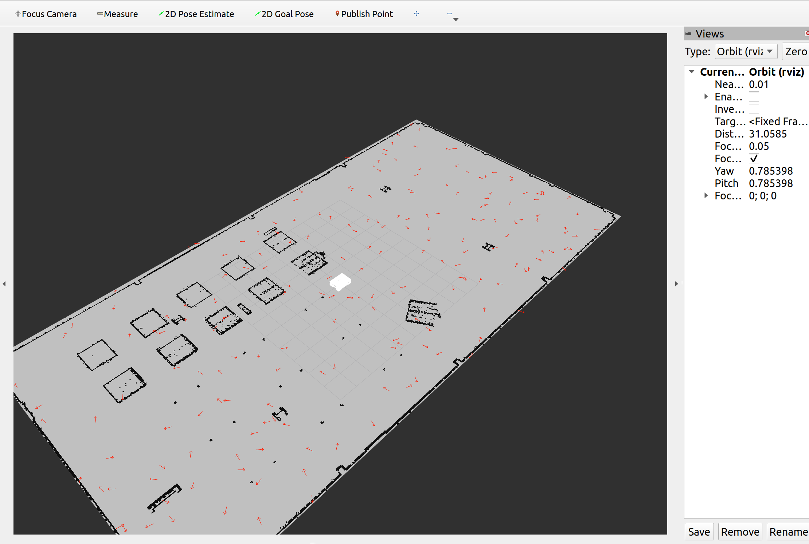
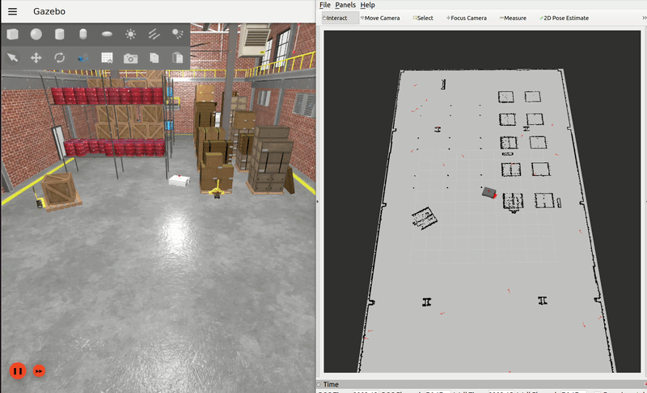
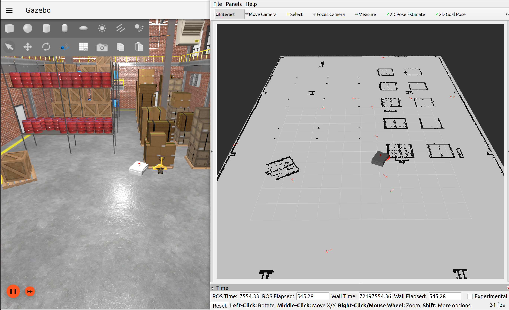

# 🤖 ros2-custom-nav-stack
Custom 2D navigation algorithms in ROS 2: Map loading, Particle Filter, A* Planner, and custom SLAM.

## 🗺️ Question 1: Map Loading and Publishing
This section details the implementation of a custom ROS 2 map server, designed to read a 2D occupancy grid from disk, process the image data, and publish it continuously for downstream navigation and localization tasks.

### 🏗️ Workspace Configuration and Node Implementation (`map_publisher.py`)
To ensure proper execution, the workspace utilizes a dedicated `maps` directory for `.yaml` and `.pgm`/`.png` assets. The `CMakeLists.txt` is configured to correctly transfer these assets and the executable `map_publisher.py` to the `install` workspace. The core of this node processes raw image data into a standard ROS 2 format. It reads the Grayscale image matrix via the `PIL` library and applies an `np.flipud` transformation to invert the Y-axis, perfectly aligning the data with the ROS 2 standard (origin at the bottom-left). Pixel intensities are then translated into occupancy probabilities using the YAML file's `free_thresh` and `occupied_thresh` parameters, assigning $0$ to free space, $100$ to obstacles, and $-1$ to unknown regions. Crucially, the `/map` topic is configured with `DurabilityPolicy.TRANSIENT_LOCAL` QoS to act as a latch, ensuring late-joining subscribers like RViz or the Particle Filter reliably receive the latest map state.

### ⚙️ Calibration, Integration, and Verification
To guarantee the published map physically aligns with the robot's simulated Gazebo environment, the exact bottom-left coordinates of the physical walls were extracted ($X = -7.80$, $Y = -15.35$) and injected into the `origin` parameter of the `depot.yaml` file. The node dynamically synchronizes the map's origin with the simulator's global origin using these values. For a streamlined bring-up, `map_publisher_node` is fully integrated into the primary `display.launch.py` launch file, inheriting the `use_sim_time` configuration for perfect temporal synchronization. The pipeline was successfully verified in RViz by setting the `Fixed Frame` to `map` and using a `Transient Local` Map display, confirming that the map walls precisely overlap with the physical boundaries perceived by the simulated robot.

---
## 📍 Question 2: Global Localization Using Particle Filter (MCL)
This section outlines the implementation of a custom Monte Carlo Localization (MCL) system from scratch. The primary objective was to bypass pre-built packages and develop a Python node (`particle_filter`) that estimates the robot's exact pose by intelligently fusing odometry data (blind movement) with laser scanner readings (environmental observation). During the initial testing and development phase, the TF tree between `map` and `odom` was temporarily bridged using a Static Transform, which was later replaced by the algorithm's dynamic TF broadcasting.

### 🎲 Initialization (Global Dispersal)
Upon startup, the robot possesses zero prior knowledge of its location within the received map. To counter this, the `initialize_particles` function is executed, which uniformly scatters exactly 200 particles across the environment. A strict logical constraint (`self.map_data == 0`) is enforced during this generation phase to guarantee that particles strictly spawn within known free spaces, avoiding any invalid initializations inside walls or obstacles.

### 🚀 Prediction Step (Motion Model)
As the robot navigates, the node actively listens to the `/ekf_diff_imu/odom` topic to compute the relative displacement and rotation (Δx, Δy, Δθ) since the last timestamp. This movement is mathematically applied to every single particle in the 200-particle pool. Recognizing that real-world kinematics are inevitably flawed by wheel slip and drift, Gaussian noise—strictly proportional to the distance traveled—is injected into the particles' kinematic updates. This effectively models the inherent uncertainty of the odometry sensor.

### 📡 Sensor Update and Weighting (Correction)
The `scan_callback` function handles the critical task of matching the robot's real-time observations against the static map. To prevent processing bottlenecks, the incoming `/scan` data is downsampled using a step size of 10. For each particle, the algorithm simulates a raycasting process: it calculates where the laser beams would hit if the robot were hypothetically positioned at that particle's exact coordinate. Simulated hits that align with mapped walls (`map_data > 50`) reward the particle with a positive score. These final scores are then squared to exponentially amplify the weights; this ensures that particles closely reflecting reality become heavily weighted, while erroneous particles lose influence.

### 🔄 Resampling and Error Recovery Mechanism
A major challenge in particle filters is the Kidnapped Robot Problem, where particles might lock onto a false location. To mitigate this, the Effective Number of Particles ($N_{eff}$) diversity index is monitored. When diversity drops, a hybrid resampling mechanism kicks in:
* **Survival of the Fittest (90%):** 90% of the new particle generation is drawn from the existing pool based on their accumulated weights, with slight noise added during duplication.
* **Random Injection (10%):** To prevent false convergence and dynamically correct errors, the remaining 10% of the capacity is strictly dedicated to purely random injection. These particles are continuously spawned in free spaces. If the robot loses its position, these random explorers quickly catch valid sensor readings and magnetically pull the rest of the swarm toward the correct location.

### 🎯 Final Pose Estimation
Ultimately, once weak particles are filtered out and strong particles tightly cluster around the real location, the `estimate_and_publish_pose` function takes over. It calculates the average X and Y coordinates, alongside the circular mean of the particles' Yaw angles (to seamlessly handle angle wrap-arounds). This definitive pose is published to `/amcl_pose`, resulting in highly accurate, real-time robot localization as it moves through the simulated environment.

