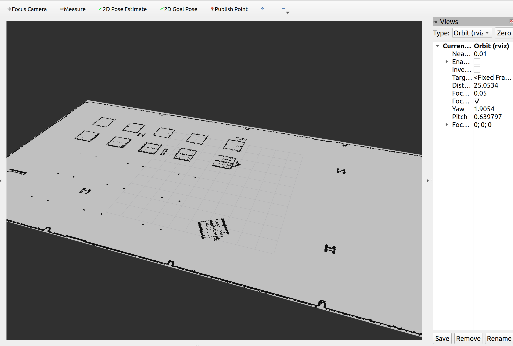

# ros2-custom-nav-stack
Custom 2D navigation algorithms in ROS 2: Map loading, Particle Filter, A* Planner, and custom SLAM.
## Question 1: Map Loading and Publishing
This section details the implementation of a custom ROS 2 map server, designed to read a 2D occupancy grid from disk, process the image data, and publish it continuously for downstream navigation and localization tasks.

### 1. Workspace and Build Configuration
To ensure proper execution and resource management, the workspace was structured as follows:
* A dedicated `maps` directory was created to store the environment's `.yaml` configuration and `.pgm`/`.png` image files.
* The `CMakeLists.txt` was configured using `install(DIRECTORY ...)` for the assets and `install(PROGRAMS ...)` for the Python scripts. This guarantees that the `colcon` build system correctly transfers the executable `map_publisher.py` to the `install` workspace.

### 2. Node Implementation (`map_publisher.py`)
The custom map publisher node processes raw image data into a standard ROS 2 format through the following operations:
* **Quality of Service (QoS):** The `/map` topic was configured with `DurabilityPolicy.TRANSIENT_LOCAL`. This critical setting acts as a latch, ensuring that late-joining subscribers (e.g., RViz, Particle Filter, or Path Planner) reliably receive the latest map state upon connection.
* **Image Processing & Coordinate Transformation:** The map image was loaded as a Grayscale matrix using the `PIL` library. Since standard image matrices place the origin at the top-left, the `np.flipud` function was utilized to invert the Y-axis. This perfectly aligns the data with the ROS 2 standard, which strictly expects the origin at the bottom-left.
* **Occupancy Value Allocation:** Using the `free_thresh` and `occupied_thresh` parameters from the YAML file, pixel intensities were translated into occupancy probabilities. Free space was assigned a value of `0`, obstacles/walls were assigned `100`, and unknown regions were marked as `-1`.

### 3. Simulation Calibration and Alignment
To ensure the published map physically aligns with the robot's simulated environment in Gazebo:
* The exact coordinates of the bottom-left corner of the physical walls were extracted directly from the Gazebo 3D environment.
* These coordinates (X = -7.80, Y = -15.35) were injected into the `origin` parameter of the `depot.yaml` file. The node dynamically reads this array to populate the `msg.info.origin.position`, accurately synchronizing the map's origin with the simulator's global origin.

### 4. Launch File Integration
To eliminate the need for manual execution and to streamline the bring-up process, the `map_publisher_node` was fully integrated into the primary launch file (`display.launch.py`). 
* The node now initializes automatically alongside the Gazebo simulation, Robot State Publisher, and EKF/VO nodes.
* It inherits the `use_sim_time` launch configuration, ensuring perfect temporal synchronization across the entire ROS 2 navigation stack.

### 5. Visualization and Verification
The pipeline was verified using RViz:
* The `Fixed Frame` in global options was set to `map`.
* A `Map` display plugin was added, listening to the `/map` topic with a `Transient Local` durability policy.
* **Result:** The computed OccupancyGrid is successfully visualized. Verifications confirm that the map walls precisely overlap with the physical boundaries perceived by the robot in the simulator.

